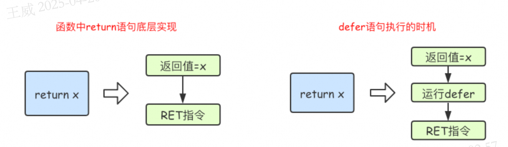

# defer

## defer如何使用

Go语言中的defer语句会将其后面跟随的语句进行延迟处理。在defer归属的函数即将返回时，将延迟处理的语句按defer定义的逆序进行执行，也就是说，先被defer的语句最后被执行，最后被defer的语句，最先被执行。

defer语句的用法：
```go
defer func() {
    // 延迟执行的代码
}()
```
defer语句的执行时机：
- 在函数返回之前执行
- 在函数的返回值被计算之后执行
- 在函数的返回值被赋值之前执行
- 在函数的返回值被传递给调用者之前执行


## defer 的执行时机

在Go语言的函数中return语句在底层并不是原子操作，它分为给返回值赋值和RET指令两步。而defer语句执行的时机就在返回值赋值操作后，RET指令执行前。具体如下图所示：

